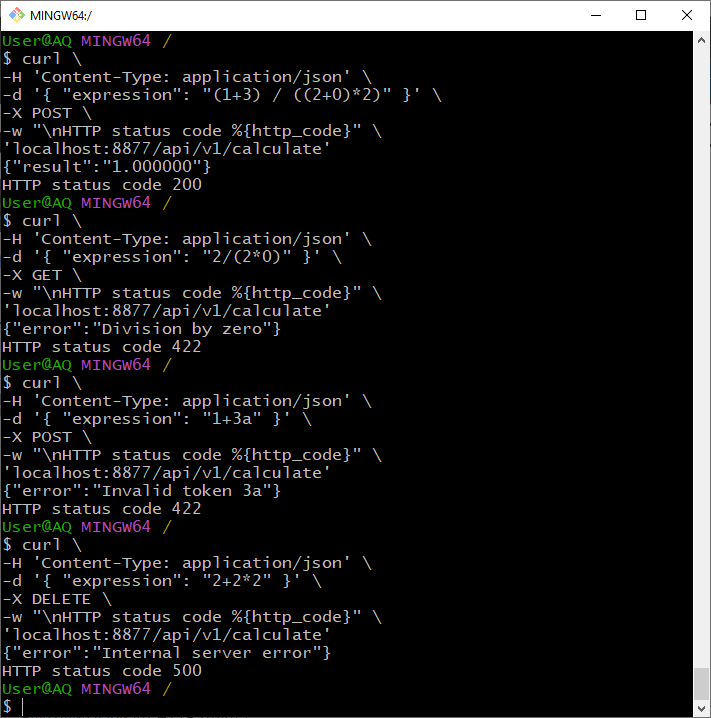

# **Web_calculator**

## Описание
Веб-сервис, вычисляющий простые арифметические выражения.

Обмен происходит в формате JSON. Пользователь отправляет на сервер, на котором запущено приложение (веб-сервис), по адресу `/api/v1/calculate`  POST-запрос с телом вида
`{ "expression": "(1+3) / ((2+0)*2)" }`.
В ответ получает ответ вида 
`{"result":"1.000000"}` либо ошибку вида `{"error":"Message"}`. Для этого удобно использовать утилиту curl:
```
curl \
-H 'Content-Type: application/json' \
-d '{ "expression": "(1+3) / ((2+0)*2)" }' \
-X POST \
-w "\nHTTP status code %{http_code}" \
'localhost:8877/api/v1/calculate'
```

Примеры запросов успешных и с ошибками:


Имитация внутренней ошибки сервера происходит при отправке любого http-метода, отличного от POST.

Настройки читаются из конфига в формате yaml. При работе приложения в stdout выводится лог, пример:
```
$ ./main.exe
time=2024-12-22T19:49:43.081+03:00 level=INFO msg="starting web_calculator app"
time=2024-12-22T19:49:43.081+03:00 level=INFO msg="server started on 127.0.0.1:8877"
time=2024-12-22T19:50:32.512+03:00 level=INFO msg="connection from 127.0.0.1:58950, method POST"
time=2024-12-22T19:51:54.006+03:00 level=INFO msg="connection from 127.0.0.1:60086, method GET"
time=2024-12-22T19:51:58.281+03:00 level=INFO msg="connection from 127.0.0.1:60356, method DELETE"
time=2024-12-22T19:52:02.577+03:00 level=INFO msg="stopping server"
time=2024-12-22T19:52:02.580+03:00 level=INFO msg="server stopped"
```

## Запуск
1. Склонировать себе репозиторий, например так `git clone https://github.com/em-qu/web_calculator.git`
2. Перейти в корневую папку проекта (там где go.mod).
3. Установить необходимые пакеты:
`go get github.com/ilyakaznacheev/cleanenv`
4. Собрать проект:
`go build cmd/main.go`
5. При необходимости отредактировать конфиг config.yaml, можно установить его кастомное расположение через переменную среды WCALC_CONFIG_PATH
6. Запустить полученный исполняемый файл.


## Тесты
Весь основной функционал покрыт тестами. Запустить все тесты  `go test -v  ./...` , пример выполнения:
```
$ go test -v  ./...
=== RUN   TestHandlerCalculate
=== RUN   TestHandlerCalculate/Valid_case
=== RUN   TestHandlerCalculate/Wrong_expression
=== RUN   TestHandlerCalculate/Division_by_zero
=== RUN   TestHandlerCalculate/Internal_server_error
--- PASS: TestHandlerCalculate (0.00s)
    --- PASS: TestHandlerCalculate/Valid_case (0.00s)
    --- PASS: TestHandlerCalculate/Wrong_expression (0.00s)
    --- PASS: TestHandlerCalculate/Division_by_zero (0.00s)
    --- PASS: TestHandlerCalculate/Internal_server_error (0.00s)
PASS
ok      github.com/em-qu/web_calculator/internal/application    1.303s
=== RUN   TestCalc
--- PASS: TestCalc (0.00s)
PASS
ok      github.com/em-qu/web_calculator/internal/rpn    0.733s
```

Для демонстрации того, что выдает калькулятор при различных некорректных входных данных, инвертируем некоторые тест-кейсы и запустим тесты только из его подпапки: 
```
$ go test -v  ./internal/rpn/...
=== RUN   TestCalc
    rpn_test.go:32: For expression "(1-5) / ((2+(0))*2)" expected error presence: true, but got: <nil>
    rpn_test.go:32: For expression "" expected error presence: false, but got: Incorrect expression
    rpn_test.go:32: For expression "9/(5*0)" expected error presence: false, but got: Division by zero
    rpn_test.go:32: For expression "(1-5) / ((2+(0)*2)" expected error presence: false, but got: Parenthesis mismatch
    rpn_test.go:32: For expression "3+O" expected error presence: false, but got: Invalid token O
    rpn_test.go:32: For expression "1\\2" expected error presence: false, but got: Invalid token 1\2
--- FAIL: TestCalc (0.00s)
FAIL
FAIL    github.com/em-qu/web_calculator/internal/rpn    0.509s
FAIL
```

